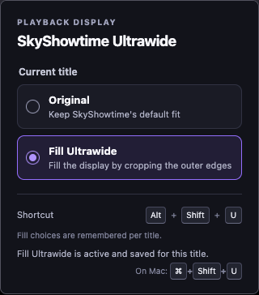

# SkyShowtime Ultrawide Firefox extension

A small Firefox extension that remembers an optional **Fill Ultrawide** choice for each SkyShowtime title.

[Download from addons.mozilla.org](https://addons.mozilla.org/addon/skyshowtime-ultrawide/)

SkyShowtime can deliver a cinematic movie inside a 16:9 video stream with encoded black bars. On an ultrawide monitor, Fill Ultrawide applies `object-fit: cover !important` to SkyShowtime's video element only, which crops those outer bars and fills the player. It does not resize the player container, subtitles, or controls.



## Why Fill Ultrawide is manual

The browser reports both letterboxed cinematic videos and genuine 16:9 programmes as the same 16:9 stream dimensions. It cannot reliably tell whether black bars are encoded into the image, so automatically enabling Fill Ultrawide could crop the top and bottom of genuine 16:9 content.

For that reason, every title without a saved choice starts in **Original** mode. When you select Fill Ultrawide, the extension saves that choice locally for the title's SkyShowtime route and restores it only when you return to that same title. Choosing Original clears the saved Fill choice for that title.

The extension deliberately does not use generic routes such as Home or Search as a title identity. If SkyShowtime does not expose a title-specific route, Fill still works for the current video but is not remembered. This conservative fallback prevents a crop from carrying over to unrelated content.

Use the popup or press **Alt+Shift+U** on Windows/Linux, or **Command+Shift+U** on Mac, while watching SkyShowtime to toggle the current video between Original and Fill Ultrawide. If Firefox has a shortcut conflict, change it in **about:addons** → gear menu → **Manage Extension Shortcuts**.

## Install temporarily in Firefox

1. Open Firefox and visit `about:debugging#/runtime/this-firefox`.
2. Choose **Load Temporary Add-on…**.
3. Select the `manifest.json` file from this folder.
4. Visit SkyShowtime, start a video, then choose **Fill Ultrawide** in the extension popup or use the keyboard shortcut.

Temporary extensions are removed when Firefox restarts. For regular use, package and sign the extension through the normal Firefox add-on process.

## Reload after editing

1. Return to `about:debugging#/runtime/this-firefox`.
2. Find **SkyShowtime Ultrawide** and select **Reload**.
3. Reload the SkyShowtime tab as well, so Firefox reinjects the updated content script.

## Project structure

```
manifest.json            Firefox Manifest V3 configuration and keyboard command
background/background.js Receives the Firefox command and messages the active tab
content/content.js       Finds the video, changes only object-fit, and stores per-title choices
popup/                   The extension popup UI and current-title state logic
icons/                   Local extension icon
```

## Privacy

This extension makes no network requests, collects no data, uses no analytics or telemetry, and loads no remote scripts. It stores only local Fill Ultrawide preferences keyed by SkyShowtime title routes. It does not inspect video frames, access video sources, interact with DRM, or intercept network traffic.

## License

MIT. See [LICENSE](LICENSE).
